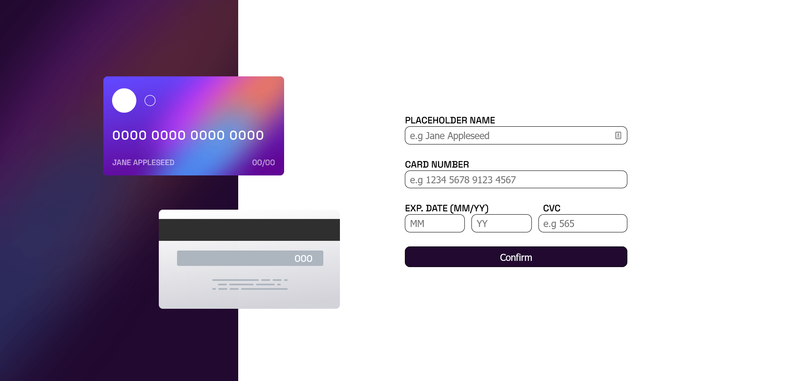
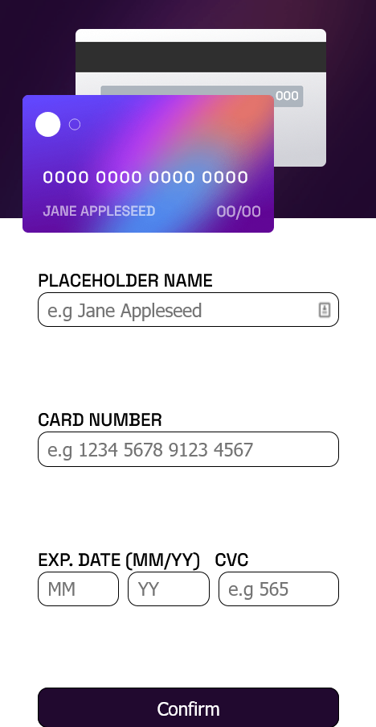

# Frontend Mentor - Interactive card details form solution

This is a solution to the [Interactive card details form challenge on Frontend Mentor](https://www.frontendmentor.io/challenges/interactive-card-details-form-XpS8cKZDWw). Frontend Mentor challenges help you improve your coding skills by building realistic projects. 

## Table of contents

- [Overview](#overview)
  - [The challenge](#the-challenge)
  - [Screenshot](#screenshot)
  - [Links](#links)
- [My process](#my-process)
  - [Built with](#built-with)
  - [What I learned](#what-i-learned)
  - [Useful resources](#useful-resources)
- [Author](#author)

## Overview

### The challenge

Users should be able to:

- Fill in the form and see the card details update in real-time
- Receive error messages when the form is submitted if:
  - Any input field is empty
  - The card number, expiry date, or CVC fields are in the wrong format
- View the optimal layout depending on their device's screen size
- See hover, active, and focus states for interactive elements on the page

### Screenshot





### Links

- [Solution URL](https://github.com/AtanasovCode/card-details-form)
- [Live Site URL](https://card-details-form.netlify.app)

## My process

### Built with

- Semantic HTML5 markup
- CSS custom properties
- Flexbox
- Mobile-first workflow
- [React](https://reactjs.org/) - JS library


### What I learned

I learned how to use React Hooks, more specifically, the useState hook. 

Other then that, I learned how to set initial values for the input fields, how to conditionally render said 
values based on the value of the input fields and how to validate the input fields. 

To see how you can add code snippets, see below:

```
  const initialValues = [
        {name: "Jane Appleseed"},
        {number: handleCardNumber("0000000000000000")},
        {month: "00"},
        {year: "00"},
    ]
```

```
  <div className="exp-date">
    {!expMonth ? initialValues.map(initial => initial.month) : expMonth}/{!expYear ? initialValues.map(initial => initial.year) : expYear}
  </div>
```


### Useful resources

If you are interested in learning React I would strongly recommend you start with the official React docs ->
[reactjs.org](https://reactjs.org/)

## Author

- Frontend Mentor - [@AtanasovCode](https://www.frontendmentor.io/profile/AtanasovCode)

